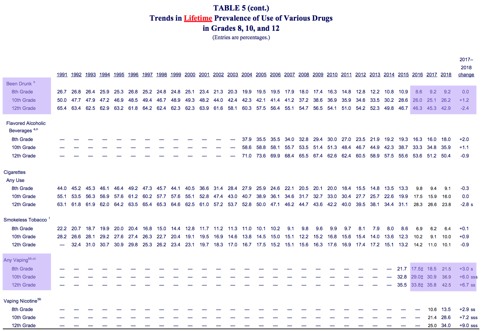
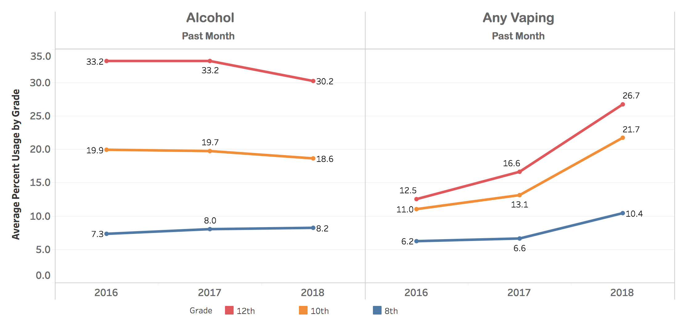

```{r setup, include = FALSE}
knitr::opts_chunk$set(echo = TRUE)
library(tidyverse)
require(haven)
```

I can use the `haven` package (part of the tidyverse) to read SAS files
```{r import_from_SAS, message = FALSE, warning = FALSE}
df1 = read_sas(data_file = "data/12th-grade-2016-2018/y2018_1.sas7bdat")
knitr::kable(df1[1:5,1:8])
```

Or just read a CSV exported from SAS.
*Note: I'm getting a lot of problems here, but I suspect it's from my original SAS work, rather than the importing step*
```{r import_from_CSV, message = FALSE, warning = FALSE}
df2 = read_csv(file = "data/ALLYEARS_81012.csv")
knitr::kable(df2[1:5,1:8])
```

# Goal #1: Reproduce a smaller version of [Table 5 from the MTF 2018 report](http://www.monitoringthefuture.org//pubs/monographs/mtf-overview2018.pdf#page=59&zoom=100,0,0)

Specifically: lifetime prevalence for any vaping and ever being drunk, split up by grade, for 2016-2018 (highlighted below).




## Step 1: get core data from all 3 years and grades into 1 table

I'll keep the cigarette, vaping, and alcohol indicators for "ever used" (lifetime prevalence) as well as "last 30 days":
<details>
<summary>Twelth grade, core form, 2016-2018 (click to see code)</summary>
```{r twelve_core_3_years, warning = FALSE, message = FALSE}
twelve_core = function(year) {
  path = paste("data/12th-grade-2016-2018/y", year, "_1.sas7bdat", sep = "")
  
  basic_set = read_sas(data_file = path) %>% 
    select(.,
           id = RESPONDENT_ID,
           year = V1,
           sex = V2150,
           cig_ever = V2101,
           cig_month = V2102,
           alc_lifetime = V2104,
           alc_month = V2106,
           alc_drunk_lifetime = V2020,
           weight = ARCHIVE_WT,
           ) %>% 
    mutate(.,
           grade = 12,
           sex = recode_factor(sex, "1" = "Male", "2" = "Female", "-9" = NA_character_),
           cig_ever = recode_factor(cig_ever, "1" = "No", "-9" = NA_character_, .default = "Yes"),
           cig_month = recode_factor(cig_month, "1" = "No", "-9" = NA_character_, .default = "Yes"),
           alc_lifetime = recode_factor(alc_lifetime, "1" = "No", "-9" = NA_character_, .default = "Yes"),
           alc_month = recode_factor(alc_month, "1" = "No", "-9" = NA_character_, .default = "Yes"),
           alc_drunk_lifetime = recode_factor(alc_drunk_lifetime, "1" = "No", "-9" = NA_character_, .default = "Yes")
           )
  
  if (year >= 2017) { # the year they added in more nuanced vaping questions
    vaping_data = read_sas(data_file = path) %>% 
     select(.,
           id = RESPONDENT_ID,
           vape_ever = V2566,
           vape_nic_lifetime = V2567,
           vape_nic_month = V2569,
           vape_mj_lifetime = V2570,
           vape_mj_month = V2572,
           vape_flav_lifetime = V2573,
           vape_flav_month = V2575
          ) %>% 
      mutate(.,
           vape_ever = recode_factor(vape_ever, "0" = "No", "1" = "Yes", "-9" = NA_character_),
           vape_nic_lifetime = recode_factor(vape_nic_lifetime, "1" = "No", "-9" = NA_character_, .default = "Yes"),
           vape_nic_month = recode_factor(vape_nic_month, "1" = "No", "-9" = NA_character_, .default = "Yes"),
           vape_mj_lifetime = recode_factor(vape_mj_lifetime, "1" = "No", "-9" = NA_character_, .default = "Yes"),
           vape_mj_month = recode_factor(vape_mj_month, "1" = "No", "-9" = NA_character_, .default = "Yes"),
           vape_flav_lifetime = recode_factor(vape_flav_lifetime, "1" = "No", "-9" = NA_character_, .default = "Yes"),
           vape_flav_month = recode_factor(vape_flav_month, "1" = "No", "-9" = NA_character_, .default = "Yes")
           ) %>% 
      mutate(., vape_any_month = as.factor(if_else(
                 (vape_nic_month == "Yes" | vape_mj_month == "Yes" | vape_flav_month == "Yes"), "Yes", "No")
                )
              )
  } else {
    vaping_data = read_sas(data_file = path) %>% 
     select(.,
           id = RESPONDENT_ID,
           vape_ever = V2551,
           vape_any_month = V2552
          ) %>% 
      mutate(.,
           vape_ever = recode_factor(vape_ever, "1" = "No", "-9" = NA_character_, .default = "Yes"),
           vape_nic_lifetime = as.factor(NA),
           vape_nic_month = as.factor(NA),
           vape_mj_lifetime = as.factor(NA),
           vape_mj_month = as.factor(NA),
           vape_flav_lifetime = as.factor(NA),
           vape_flav_month = as.factor(NA),
           vape_any_month = recode_factor(vape_any_month, "1" = "No", "-9" = NA_character_, .default = "Yes")
           )
  }
  output = full_join(basic_set, vaping_data, by = "id")
  
  output
}

twelve_combined = tibble()
for (year in 2016:2018) {
  # need to sort alphabetically before binding rows (or find a way to combine data frames vertically, by comlumn name)
  one_year = twelve_core(year) %>% select(sort(current_vars()))
  
  # bind_rows() changes factor columns into characters if the factors don't match up, so I used rbind() instead.
  twelve_combined = rbind(twelve_combined, one_year)
}

knitr::kable(head(twelve_combined))
summary(twelve_combined[, c(1, 2, 8, 9, 10, 11)])
```
</details>

<details>
<summary>Eighth & tenth grade, core form, 2016-2018 (click to see code)</summary>
```{r eight_ten_core_3_years, warning = FALSE, message = FALSE}
eight_ten_core = function(year) {
  path = paste("data/8th-10th-grades-2016-2018/y_", year, "_810_1.sas7bdat", sep = "")
  
  # using data from all forms, and later I'll kick out people who didn't get asked a specific question
  basic_set = read_sas(data_file = path) %>% 
    select(.,
           id = CASEID,
           year = V1,
           sex = V7202,
           cig_ever = V7101,
           cig_month = V7102,
           alc_lifetime = V7104,
           alc_month = V7107,
           alc_drunk_lifetime = V7109,
           weight = V5,
           grade = V501
           ) %>% 
    mutate(.,
           sex = recode_factor(sex, "1" = "Male", "2" = "Female", "-9" = NA_character_),
           cig_ever = recode_factor(cig_ever, "1" = "No", "-9" = NA_character_, .default = "Yes"),
           cig_month = recode_factor(cig_month, "1" = "No", "-9" = NA_character_, .default = "Yes"),
           alc_lifetime = recode_factor(alc_lifetime, "1" = "No", "2" = "Yes","-9" = NA_character_),
           alc_month = recode_factor(alc_month, "1" = "No", "-9" = NA_character_, .default = "Yes"),
           alc_drunk_lifetime = recode_factor(alc_drunk_lifetime, "1" = "No", "-9" = NA_character_, .default = "Yes")
           )
  
  if (year >= 2017) { # the year they added in more nuanced vaping questions
    vaping_data = read_sas(data_file = path) %>% 
     select(.,
           id = CASEID,
           vape_ever = V7648,
           vape_nic_lifetime = V7649,
           vape_nic_month = V7651,
           vape_mj_lifetime = V7652,
           vape_mj_month = V7654,
           vape_flav_lifetime = V7655,
           vape_flav_month = V7657
          ) %>% 
      mutate(.,
           vape_ever = recode_factor(vape_ever, "0" = "No", "1" = "Yes", "-9" = NA_character_, "-8" = "Not asked on this form"),
           vape_nic_lifetime = recode_factor(vape_nic_lifetime, "1" = "No", "-9" = NA_character_, "-8" = "Not asked on this form", .default = "Yes"),
           vape_nic_month = recode_factor(vape_nic_month, "1" = "No", "-9" = NA_character_, "-8" = "Not asked on this form", .default = "Yes"),
           vape_mj_lifetime = recode_factor(vape_mj_lifetime, "1" = "No", "-9" = NA_character_, "-8" = "Not asked on this form", .default = "Yes"),
           vape_mj_month = recode_factor(vape_mj_month, "1" = "No", "-9" = NA_character_, "-8" = "Not asked on this form", .default = "Yes"),
           vape_flav_lifetime = recode_factor(vape_flav_lifetime, "1" = "No", "-9" = NA_character_, "-8" = "Not asked on this form", .default = "Yes"),
           vape_flav_month = recode_factor(vape_flav_month, "1" = "No", "-9" = NA_character_, "-8" = "Not asked on this form", .default = "Yes")
           ) %>% 
      mutate(., vape_any_month = as.factor(if_else(
                 (vape_nic_month == "Yes" | vape_mj_month == "Yes" | vape_flav_month == "Yes"), "Yes", "No")
                )
              )
  } else {
    vaping_data = read_sas(data_file = path) %>% 
     select(.,
           id = CASEID,
           vape_ever = V7625,
           vape_any_month = V7626
          ) %>% 
      mutate(.,
           vape_ever = recode_factor(vape_ever, "1" = "No", "-9" = NA_character_, "-8" = "Not asked on this form", .default = "Yes"),
           vape_nic_lifetime = as.factor("Not asked on this form"),
           vape_nic_month = as.factor("Not asked on this form"),
           vape_mj_lifetime = as.factor("Not asked on this form"),
           vape_mj_month = as.factor("Not asked on this form"),
           vape_flav_lifetime = as.factor("Not asked on this form"),
           vape_flav_month = as.factor("Not asked on this form"),
           vape_any_month = recode_factor(vape_any_month, "1" = "No", "-9" = NA_character_, "-8" = "Not asked on this form", .default = "Yes")
           )
  }
  output = full_join(basic_set, vaping_data, by = "id")
  
  output
}

eight_ten_combined = tibble()
for (year in 2016:2018) {
  # need to sort alphabetically before binding rows (or find a way to combine data frames vertically, by comlumn name)
  one_year = eight_ten_core(year) %>% select(sort(current_vars()))
  
  # bind_rows() changes factor columns into characters if the factors don't match up, so I used rbind() instead.
  eight_ten_combined = rbind(eight_ten_combined, one_year)
}

# TODO: fix problem where I'm getting too many responses (likely because the same question is asked on multiple forms)
knitr::kable(head(eight_ten_combined))
summary(eight_ten_combined[, c(1, 2, 7, 8, 9)])
```
</details>

```{r, echo = FALSE, eval = FALSE}
# require(table1)
```


# Goal #2: Reproduce trend graphs from the [NIDA for Teens interactive chart](https://teens.drugabuse.gov/teachers/stats-and-trends-teen-drug-use)

Specifically, I'd like to make [this view](https://public.tableau.com/shared/JF2B545PM?:display_count=y&:origin=viz_share_link&:embed=y), showing 8th, 10th, and 12th grade trends in past-30-day alcohol use and vaping, from 2016-2018.




# Goal #3: Use information from across multiple forms

???

# Questions:
* What should I do about the weights?
* Should I include missing data in the denominator for prevalences?
* How should I weight something if I'm trying to combine 8th, 10th, and 12th grades?
* For a question like *V2566: BY18 34230 EVER VAPE (p. 56, 12th grade)*, what does 70% missing mean? were some large amount of participants not asked? 