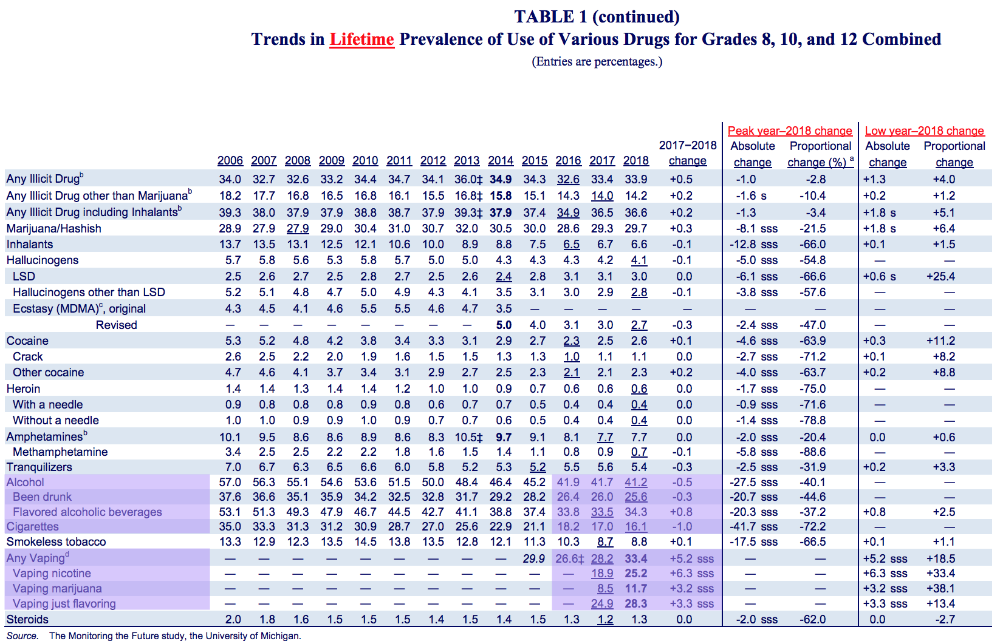

MTF - getting started, testing out data import/export etc.
================

I can use the `haven` package (part of the tidyverse) to read SAS files

``` r
df1 = read_sas(data_file = "data/12th-grade-2016-2018/y2018_1.sas7bdat")
knitr::kable(df1[1:5,1:8])
```

| CASEID | RESPONDENT\_ID |   V1 | V3 | ARCHIVE\_WT | V13 | V16 | V17 |
| -----: | -------------: | ---: | -: | ----------: | --: | --: | --: |
|      1 |          10001 | 2018 |  1 |    1.608167 |   3 |   0 |   1 |
|      2 |          10002 | 2018 |  1 |    1.357766 |   3 |   0 |   1 |
|      3 |          10003 | 2018 |  1 |    1.546913 |   3 |   0 |   1 |
|      4 |          10004 | 2018 |  1 |    1.542995 |   3 |   0 |   1 |
|      5 |          10005 | 2018 |  1 |    1.451582 |   3 |   0 |   1 |

Or just read a CSV exported from SAS. *Note: I’m getting a lot of
problems here, but I suspect it’s from my original SAS work, rather than
the importing step*

``` r
df2 = read_csv(file = "data/ALLYEARS_81012.csv")
knitr::kable(df2[1:5,1:8])
```

| year |    id | formid | grade | gpa | smp\_wgt | sex | race2 |
| ---: | ----: | -----: | ----: | --: | -------: | --: | ----: |
| 1991 | 70001 |      1 |     8 |   1 |   0.8556 |   1 |    NA |
| 1991 | 70002 |      1 |     8 |   3 |   0.8815 |   1 |    NA |
| 1991 | 70003 |      1 |     8 |   3 |   1.2194 |   1 |     0 |
| 1991 | 70004 |      1 |     8 |   1 |   0.4084 |   1 |    NA |
| 1991 | 70005 |      1 |     8 |  NA |   0.4367 |  NA |    NA |

# Goal \#1: Reproduce a smaller version of [Table 1 from the MTF 2018 report](http://www.monitoringthefuture.org//pubs/monographs/mtf-overview2018.pdf#page=59&zoom=100,0,0)

Specifically: lifetime prevalence of use of a handful of different
substances among all grades combined, for 2016-2018 (highlighted below).



## Step 1: get core data from all 3 years and grades into 1 table

I’ll keep the cigarette, vaping, and alcohol indicators for “ever used”
(lifetime prevalence) as well as “last 30 days”:

<details>

<summary>Twelth grade, core form, 2016-2018 (click to see
code)</summary>

``` r
twelve_core = function(year) {
  path = paste("data/12th-grade-2016-2018/y", year, "_1.sas7bdat", sep = "")
  
  basic_set = read_sas(data_file = path) %>% 
    select(.,
           id = RESPONDENT_ID,
           year = V1,
           sex = V2150,
           cig_ever = V2101,
           cig_month = V2102,
           alc_lifetime = V2104,
           alc_month = V2106,
           alc_drunk_lifetime = V2020,
           weight = ARCHIVE_WT,
           ) %>% 
    mutate(.,
           grade = 12,
           sex = recode_factor(sex, "1" = "Male", "2" = "Female", "-9" = NA_character_),
           cig_ever = recode_factor(cig_ever, "1" = "No", "-9" = NA_character_, .default = "Yes"),
           cig_month = recode_factor(cig_month, "1" = "No", "-9" = NA_character_, .default = "Yes"),
           alc_lifetime = recode_factor(alc_lifetime, "1" = "No", "-9" = NA_character_, .default = "Yes"),
           alc_month = recode_factor(alc_month, "1" = "No", "-9" = NA_character_, .default = "Yes"),
           alc_drunk_lifetime = recode_factor(alc_drunk_lifetime, "1" = "No", "-9" = NA_character_, .default = "Yes")
           )
  
  if (year >= 2017) { # the year they added in more nuanced vaping questions
    vaping_data = read_sas(data_file = path) %>% 
     select(.,
           id = RESPONDENT_ID,
           vape_ever = V2566,
           vape_nic_lifetime = V2567,
           vape_nic_month = V2569,
           vape_mj_lifetime = V2570,
           vape_mj_month = V2572,
           vape_flav_lifetime = V2573,
           vape_flav_month = V2575
          ) %>% 
      mutate(.,
           vape_ever = recode_factor(vape_ever, "0" = "No", "1" = "Yes", "-9" = NA_character_),
           vape_nic_lifetime = recode_factor(vape_nic_lifetime, "1" = "No", "-9" = NA_character_, .default = "Yes"),
           vape_nic_month = recode_factor(vape_nic_month, "1" = "No", "-9" = NA_character_, .default = "Yes"),
           vape_mj_lifetime = recode_factor(vape_mj_lifetime, "1" = "No", "-9" = NA_character_, .default = "Yes"),
           vape_mj_month = recode_factor(vape_mj_month, "1" = "No", "-9" = NA_character_, .default = "Yes"),
           vape_flav_lifetime = recode_factor(vape_flav_lifetime, "1" = "No", "-9" = NA_character_, .default = "Yes"),
           vape_flav_month = recode_factor(vape_flav_month, "1" = "No", "-9" = NA_character_, .default = "Yes")
           ) %>% 
      mutate(., vape_any_month = as.factor(if_else(
                 (vape_nic_month == "Yes" | vape_mj_month == "Yes" | vape_flav_month == "Yes"), "Yes", "No")
                )
              )
  } else {
    vaping_data = read_sas(data_file = path) %>% 
     select(.,
           id = RESPONDENT_ID,
           vape_ever = V2551,
           vape_any_month = V2552
          ) %>% 
      mutate(.,
           vape_ever = recode_factor(vape_ever, "1" = "No", "-9" = NA_character_, .default = "Yes"),
           vape_nic_lifetime = as.factor(NA),
           vape_nic_month = as.factor(NA),
           vape_mj_lifetime = as.factor(NA),
           vape_mj_month = as.factor(NA),
           vape_flav_lifetime = as.factor(NA),
           vape_flav_month = as.factor(NA),
           vape_any_month = recode_factor(vape_any_month, "1" = "No", "-9" = NA_character_, .default = "Yes")
           )
  }
  output = full_join(basic_set, vaping_data, by = "id")
  
  output
}

combined = tibble()
for (year in 2016:2018) {
  # need to sort alphabetically before binding rows (or find a way to combine data frames vertically, by comlumn name)
  one_year = twelve_core(year) %>% select(sort(current_vars()))
  
  # bind_rows() changes factor columns into characters if the factors don't match up, so I used rbind instead.
  combined = rbind(combined, one_year)
}

knitr::kable(head(combined))
```

| alc\_drunk\_lifetime | alc\_lifetime | alc\_month | cig\_ever | cig\_month | grade |    id | sex    | vape\_any\_month | vape\_ever | vape\_flav\_lifetime | vape\_flav\_month | vape\_mj\_lifetime | vape\_mj\_month | vape\_nic\_lifetime | vape\_nic\_month |   weight | year |
| :------------------- | :------------ | :--------- | :-------- | :--------- | ----: | ----: | :----- | :--------------- | :--------- | :------------------- | :---------------- | :----------------- | :-------------- | :------------------ | :--------------- | -------: | ---: |
| Yes                  | Yes           | Yes        | Yes       | No         |    12 | 10001 | Male   | Yes              | Yes        | NA                   | NA                | NA                 | NA              | NA                  | NA               | 1.306960 | 2016 |
| Yes                  | Yes           | Yes        | No        | No         |    12 | 10002 | Female | No               | No         | NA                   | NA                | NA                 | NA              | NA                  | NA               | 1.453475 | 2016 |
| Yes                  | Yes           | No         | Yes       | No         |    12 | 10003 | Male   | No               | Yes        | NA                   | NA                | NA                 | NA              | NA                  | NA               | 1.399638 | 2016 |
| No                   | No            | No         | No        | No         |    12 | 10004 | Female | No               | No         | NA                   | NA                | NA                 | NA              | NA                  | NA               | 1.416772 | 2016 |
| Yes                  | Yes           | Yes        | Yes       | Yes        |    12 | 10005 | Male   | Yes              | Yes        | NA                   | NA                | NA                 | NA              | NA                  | NA               | 1.515468 | 2016 |
| No                   | Yes           | No         | No        | No         |    12 | 10006 | Male   | No               | No         | NA                   | NA                | NA                 | NA              | NA                  | NA               | 1.416125 | 2016 |

``` r
summary(combined[, c(1, 2, 8, 9, 10, 11)])
```

    ##  alc_drunk_lifetime alc_lifetime     sex        vape_any_month vape_ever   
    ##  No  : 6329         No  :14300   Male  :17722   No  : 9632     No  : 7508  
    ##  Yes : 5409         Yes :23039   Female:18559   Yes : 2437     Yes : 4686  
    ##  NA's:28886         NA's: 3285   NA's  : 4343   NA's:28555     NA's:28430  
    ##  vape_flav_lifetime
    ##  No  : 5624        
    ##  Yes : 2761        
    ##  NA's:32239

</details>

# Goal \#2: Reproduce trend graphs from the [NIDA for Teens interactive chart](https://teens.drugabuse.gov/teachers/stats-and-trends-teen-drug-use)

Specifically, I’d like to make [this
view](https://public.tableau.com/shared/JF2B545PM?:display_count=y&:origin=viz_share_link&:embed=y),
showing 8th, 10th, and 12th grade trends in past-30-day alcohol use and
vaping, from 2016-2018.


# Goal \#3: Use information from across multiple forms

???

# Questions:

  - What should I do about the weights?
  - Should I include missing data in the denominator for prevalences?
  - For a question like *V2566: BY18 34230 EVER VAPE (p. 56)*, what does
    70% missing mean? were some large amount of participants not asked?
