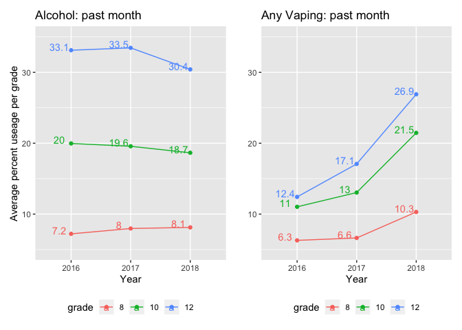
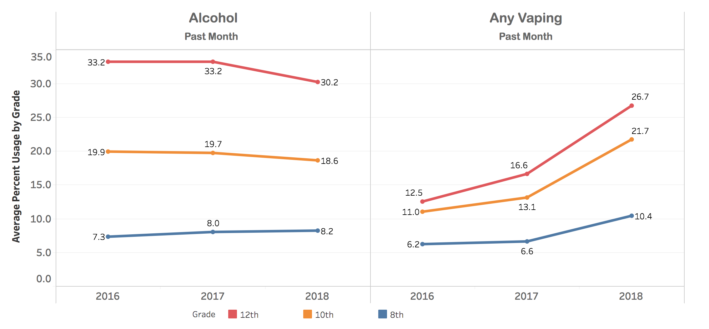

MTF - getting started, testing out data import/export etc.
================

I can use the `haven` package (part of the tidyverse) to read SAS files

``` r
df1 = read_sas(data_file = "data/12th-grade-2016-2018/y2018_1.sas7bdat")
knitr::kable(df1[1:5,1:8])
```

| CASEID | RESPONDENT\_ID |   V1 | V3 | ARCHIVE\_WT | V13 | V16 | V17 |
| -----: | -------------: | ---: | -: | ----------: | --: | --: | --: |
|      1 |          10001 | 2018 |  1 |    1.608167 |   3 |   0 |   1 |
|      2 |          10002 | 2018 |  1 |    1.357766 |   3 |   0 |   1 |
|      3 |          10003 | 2018 |  1 |    1.546913 |   3 |   0 |   1 |
|      4 |          10004 | 2018 |  1 |    1.542995 |   3 |   0 |   1 |
|      5 |          10005 | 2018 |  1 |    1.451582 |   3 |   0 |   1 |

Or just read a CSV exported from SAS. *Note: I’m getting a lot of
problems here, but I suspect it’s from my original SAS work, rather than
the importing step*

``` r
df2 = read_csv(file = "data/ALLYEARS_81012.csv")
knitr::kable(df2[1:5,1:8])
```

| year |    id | formid | grade | gpa | smp\_wgt | sex | race2 |
| ---: | ----: | -----: | ----: | --: | -------: | --: | ----: |
| 1991 | 70001 |      1 |     8 |   1 |   0.8556 |   1 |    NA |
| 1991 | 70002 |      1 |     8 |   3 |   0.8815 |   1 |    NA |
| 1991 | 70003 |      1 |     8 |   3 |   1.2194 |   1 |     0 |
| 1991 | 70004 |      1 |     8 |   1 |   0.4084 |   1 |    NA |
| 1991 | 70005 |      1 |     8 |  NA |   0.4367 |  NA |    NA |

# Goal \#1: Reproduce a smaller version of [Table 5 from the MTF 2018 report](http://www.monitoringthefuture.org//pubs/monographs/mtf-overview2018.pdf#page=59&zoom=100,0,0)

Specifically: lifetime prevalence for any vaping and ever being drunk,
split up by grade, for 2016-2018 (highlighted below).

## Step 1: get core data from all 3 years and grades into 1 table

I’ll keep the cigarette, vaping, and alcohol indicators for “ever used”
(lifetime prevalence) as well as “last 30 days”:

<details>

<summary>Twelth grade, core form, 2016-2018 (click to see
code)</summary>

``` r
twelve_core = function(year) {
  path = paste("data/12th-grade-2016-2018/y", year, "_1.sas7bdat", sep = "")
  
  basic_set = read_sas(data_file = path) %>% 
    select(.,
           id = RESPONDENT_ID,
           year = V1,
           sex = V2150,
           cig_ever = V2101,
           cig_month = V2102,
           alc_lifetime = V2104,
           alc_month = V2106,
           alc_drunk_lifetime = V2020,
           weight = ARCHIVE_WT,
           ) %>% 
    mutate(.,
           grade = 12,
           sex = recode_factor(sex, "1" = "Male", "2" = "Female", "-9" = NA_character_),
           cig_ever = recode_factor(cig_ever, "1" = "No", "-9" = NA_character_, .default = "Yes"),
           cig_month = recode_factor(cig_month, "1" = "No", "-9" = NA_character_, .default = "Yes"),
           alc_lifetime = recode_factor(alc_lifetime, "1" = "No", "-9" = NA_character_, .default = "Yes"),
           alc_month = recode_factor(alc_month, "1" = "No", "-9" = NA_character_, .default = "Yes"),
           alc_drunk_lifetime = recode_factor(alc_drunk_lifetime, "1" = "No", "-9" = NA_character_, .default = "Yes")
           )
  
  if (year >= 2017) { # the year they added in more nuanced vaping questions
    vaping_data = read_sas(data_file = path) %>% 
     select(.,
           id = RESPONDENT_ID,
           vape_ever = V2566,
           vape_nic_lifetime = V2567,
           vape_nic_month = V2569,
           vape_mj_lifetime = V2570,
           vape_mj_month = V2572,
           vape_flav_lifetime = V2573,
           vape_flav_month = V2575
          ) %>% 
      mutate(.,
           vape_ever = recode_factor(vape_ever, "0" = "No", "1" = "Yes", "-9" = NA_character_),
           vape_nic_lifetime = recode_factor(vape_nic_lifetime, "1" = "No", "-9" = NA_character_, .default = "Yes"),
           vape_nic_month = recode_factor(vape_nic_month, "1" = "No", "-9" = NA_character_, .default = "Yes"),
           vape_mj_lifetime = recode_factor(vape_mj_lifetime, "1" = "No", "-9" = NA_character_, .default = "Yes"),
           vape_mj_month = recode_factor(vape_mj_month, "1" = "No", "-9" = NA_character_, .default = "Yes"),
           vape_flav_lifetime = recode_factor(vape_flav_lifetime, "1" = "No", "-9" = NA_character_, .default = "Yes"),
           vape_flav_month = recode_factor(vape_flav_month, "1" = "No", "-9" = NA_character_, .default = "Yes")
           ) %>% 
      mutate(., vape_any_month = as.factor(if_else(
                 (vape_nic_month == "Yes" | vape_mj_month == "Yes" | vape_flav_month == "Yes"), "Yes", "No")
                )
              )
  } else {
    vaping_data = read_sas(data_file = path) %>% 
     select(.,
           id = RESPONDENT_ID,
           vape_ever = V2551,
           vape_any_month = V2552
          ) %>% 
      mutate(.,
           vape_ever = recode_factor(vape_ever, "1" = "No", "-9" = NA_character_, .default = "Yes"),
           vape_nic_lifetime = as.factor(NA),
           vape_nic_month = as.factor(NA),
           vape_mj_lifetime = as.factor(NA),
           vape_mj_month = as.factor(NA),
           vape_flav_lifetime = as.factor(NA),
           vape_flav_month = as.factor(NA),
           vape_any_month = recode_factor(vape_any_month, "1" = "No", "-9" = NA_character_, .default = "Yes")
           )
  }
  output = full_join(basic_set, vaping_data, by = "id")
  
  output
}

twelve_combined = tibble()
for (year in 2016:2018) {
  # need to sort alphabetically before binding rows (or find a way to combine data frames vertically, by comlumn name)
  one_year = twelve_core(year) %>% select(sort(current_vars()))
  
  # bind_rows() changes factor columns into characters if the factors don't match up, so I used rbind() instead.
  twelve_combined = rbind(twelve_combined, one_year)
}

knitr::kable(head(twelve_combined))
```

| alc\_drunk\_lifetime | alc\_lifetime | alc\_month | cig\_ever | cig\_month | grade |    id | sex    | vape\_any\_month | vape\_ever | vape\_flav\_lifetime | vape\_flav\_month | vape\_mj\_lifetime | vape\_mj\_month | vape\_nic\_lifetime | vape\_nic\_month |   weight | year |
| :------------------- | :------------ | :--------- | :-------- | :--------- | ----: | ----: | :----- | :--------------- | :--------- | :------------------- | :---------------- | :----------------- | :-------------- | :------------------ | :--------------- | -------: | ---: |
| Yes                  | Yes           | Yes        | Yes       | No         |    12 | 10001 | Male   | Yes              | Yes        | NA                   | NA                | NA                 | NA              | NA                  | NA               | 1.306960 | 2016 |
| Yes                  | Yes           | Yes        | No        | No         |    12 | 10002 | Female | No               | No         | NA                   | NA                | NA                 | NA              | NA                  | NA               | 1.453475 | 2016 |
| Yes                  | Yes           | No         | Yes       | No         |    12 | 10003 | Male   | No               | Yes        | NA                   | NA                | NA                 | NA              | NA                  | NA               | 1.399638 | 2016 |
| No                   | No            | No         | No        | No         |    12 | 10004 | Female | No               | No         | NA                   | NA                | NA                 | NA              | NA                  | NA               | 1.416772 | 2016 |
| Yes                  | Yes           | Yes        | Yes       | Yes        |    12 | 10005 | Male   | Yes              | Yes        | NA                   | NA                | NA                 | NA              | NA                  | NA               | 1.515468 | 2016 |
| No                   | Yes           | No         | No        | No         |    12 | 10006 | Male   | No               | No         | NA                   | NA                | NA                 | NA              | NA                  | NA               | 1.416125 | 2016 |

``` r
summary(twelve_combined[, c(1, 2, 8, 9, 10, 11)])
```

    ##  alc_drunk_lifetime alc_lifetime     sex        vape_any_month vape_ever   
    ##  No  : 6329         No  :14300   Male  :17722   No  : 9632     No  : 7508  
    ##  Yes : 5409         Yes :23039   Female:18559   Yes : 2437     Yes : 4686  
    ##  NA's:28886         NA's: 3285   NA's  : 4343   NA's:28555     NA's:28430  
    ##  vape_flav_lifetime
    ##  No  : 5624        
    ##  Yes : 2761        
    ##  NA's:32239

</details>

<details>

<summary>Eighth & tenth grade, core form, 2016-2018 (click to see
code)</summary>

``` r
eight_ten_core = function(year) {
  path = paste("data/8th-10th-grades-2016-2018/y_", year, "_810_1.sas7bdat", sep = "")
  
  # using data from all forms, and later I'll kick out people who didn't get asked a specific question
  basic_set = read_sas(data_file = path) %>% 
    select(.,
           id = CASEID,
           year = V1,
           sex = V7202,
           cig_ever = V7101,
           cig_month = V7102,
           alc_lifetime = V7104,
           alc_month = V7107,
           alc_drunk_lifetime = V7109,
           weight = V5,
           grade = V501
           ) %>% 
    mutate(.,
           sex = recode_factor(sex, "1" = "Male", "2" = "Female", "-9" = NA_character_),
           cig_ever = recode_factor(cig_ever, "1" = "No", "-9" = NA_character_, .default = "Yes"),
           cig_month = recode_factor(cig_month, "1" = "No", "-9" = NA_character_, .default = "Yes"),
           alc_lifetime = recode_factor(alc_lifetime, "1" = "No", "2" = "Yes","-9" = NA_character_),
           alc_month = recode_factor(alc_month, "1" = "No", "-9" = NA_character_, .default = "Yes"),
           alc_drunk_lifetime = recode_factor(alc_drunk_lifetime, "1" = "No", "-9" = NA_character_, .default = "Yes")
           )
  
  if (year >= 2017) { # the year they added in more nuanced vaping questions
    vaping_data = read_sas(data_file = path) %>% 
     select(.,
           id = CASEID,
           vape_ever = V7648,
           vape_nic_lifetime = V7649,
           vape_nic_month = V7651,
           vape_mj_lifetime = V7652,
           vape_mj_month = V7654,
           vape_flav_lifetime = V7655,
           vape_flav_month = V7657
          ) %>% 
      mutate(.,
           vape_ever = recode_factor(vape_ever, "0" = "No", "1" = "Yes", "-9" = NA_character_, "-8" = "Not asked on this form"),
           vape_nic_lifetime = recode_factor(vape_nic_lifetime, "1" = "No", "-9" = NA_character_, "-8" = "Not asked on this form", .default = "Yes"),
           vape_nic_month = recode_factor(vape_nic_month, "1" = "No", "-9" = NA_character_, "-8" = "Not asked on this form", .default = "Yes"),
           vape_mj_lifetime = recode_factor(vape_mj_lifetime, "1" = "No", "-9" = NA_character_, "-8" = "Not asked on this form", .default = "Yes"),
           vape_mj_month = recode_factor(vape_mj_month, "1" = "No", "-9" = NA_character_, "-8" = "Not asked on this form", .default = "Yes"),
           vape_flav_lifetime = recode_factor(vape_flav_lifetime, "1" = "No", "-9" = NA_character_, "-8" = "Not asked on this form", .default = "Yes"),
           vape_flav_month = recode_factor(vape_flav_month, "1" = "No", "-9" = NA_character_, "-8" = "Not asked on this form", .default = "Yes")
           ) %>% 
      mutate(., vape_any_month = as.factor(case_when(
                 vape_nic_month == "Not asked on this form" ~ "Not asked on this form", # all these questions are asked on the same form (2)
                 (vape_nic_month == "Yes" | vape_mj_month == "Yes" | vape_flav_month == "Yes") ~ "Yes",
                 (is.na(vape_nic_month) & is.na(vape_mj_month) & is.na(vape_flav_month)) ~ NA_character_,
                 TRUE ~ "No")
                )
              )
  } else {
    vaping_data = read_sas(data_file = path) %>% 
     select(.,
           id = CASEID,
           vape_ever = V7625,
           vape_any_month = V7626
          ) %>% 
      mutate(.,
           vape_ever = recode_factor(vape_ever, "1" = "No", "-9" = NA_character_, "-8" = "Not asked on this form", .default = "Yes"),
           vape_nic_lifetime = as.factor("Not asked on this form"),
           vape_nic_month = as.factor("Not asked on this form"),
           vape_mj_lifetime = as.factor("Not asked on this form"),
           vape_mj_month = as.factor("Not asked on this form"),
           vape_flav_lifetime = as.factor("Not asked on this form"),
           vape_flav_month = as.factor("Not asked on this form"),
           vape_any_month = recode_factor(vape_any_month, "1" = "No", "-9" = NA_character_, "-8" = "Not asked on this form", .default = "Yes")
           )
  }
  output = full_join(basic_set, vaping_data, by = "id")
  
  output
}

eight_ten_combined = tibble()
for (year in 2016:2018) {
  # need to sort alphabetically before binding rows (or find a way to combine data frames vertically, by comlumn name)
  one_year = eight_ten_core(year) %>% select(sort(current_vars()))
  
  # bind_rows() changes factor columns into characters if the factors don't match up, so I used rbind() instead.
  eight_ten_combined = rbind(eight_ten_combined, one_year)
}

knitr::kable(head(eight_ten_combined))
```

| alc\_drunk\_lifetime | alc\_lifetime | alc\_month | cig\_ever | cig\_month | grade | id | sex    | vape\_any\_month       | vape\_ever             | vape\_flav\_lifetime   | vape\_flav\_month      | vape\_mj\_lifetime     | vape\_mj\_month        | vape\_nic\_lifetime    | vape\_nic\_month       |    weight | year |
| :------------------- | :------------ | :--------- | :-------- | :--------- | ----: | -: | :----- | :--------------------- | :--------------------- | :--------------------- | :--------------------- | :--------------------- | :--------------------- | :--------------------- | :--------------------- | --------: | ---: |
| No                   | No            | No         | No        | No         |     8 |  1 | Female | Not asked on this form | Not asked on this form | Not asked on this form | Not asked on this form | Not asked on this form | Not asked on this form | Not asked on this form | Not asked on this form | 0.7856047 | 2016 |
| NA                   | Yes           | Yes        | Yes       | Yes        |     8 |  2 | Male   | Not asked on this form | Not asked on this form | Not asked on this form | Not asked on this form | Not asked on this form | Not asked on this form | Not asked on this form | Not asked on this form | 1.2791966 | 2016 |
| Yes                  | Yes           | Yes        | No        | No         |    10 |  3 | Female | Not asked on this form | Not asked on this form | Not asked on this form | Not asked on this form | Not asked on this form | Not asked on this form | Not asked on this form | Not asked on this form | 0.6264969 | 2016 |
| No                   | Yes           | No         | No        | No         |    10 |  4 | Male   | Not asked on this form | Not asked on this form | Not asked on this form | Not asked on this form | Not asked on this form | Not asked on this form | Not asked on this form | Not asked on this form | 0.9297171 | 2016 |
| No                   | No            | No         | No        | No         |     8 |  5 | Male   | No                     | No                     | Not asked on this form | Not asked on this form | Not asked on this form | Not asked on this form | Not asked on this form | Not asked on this form | 0.6221151 | 2016 |
| No                   | No            | No         | No        | No         |    10 |  6 | Female | Not asked on this form | Not asked on this form | Not asked on this form | Not asked on this form | Not asked on this form | Not asked on this form | Not asked on this form | Not asked on this form | 1.0048257 | 2016 |

``` r
summary(eight_ten_combined[, c(1, 2, 7, 8, 9)])
```

    ##  alc_drunk_lifetime alc_lifetime       id            sex       
    ##  No  :69710         No  :57482   Min.   :    1   Male  :43847  
    ##  Yes :14899         Yes :29131   1st Qu.: 7753   Female:44021  
    ##  NA's: 8425         NA's: 6421   Median :15506   NA's  : 5166  
    ##                                  Mean   :15534                 
    ##                                  3rd Qu.:23259                 
    ##                                  Max.   :32873                 
    ##                 vape_any_month 
    ##  No                    :25306  
    ##  Not asked on this form:62019  
    ##  Yes                   : 3457  
    ##  NA's                  : 2252  
    ##                                
    ## 

</details>

Combine information from all grades across all 3 years:

``` r
# Check and make sure it was ok to combine these one on top of another
colnames(eight_ten_combined) == colnames(twelve_combined)
```

    ##  [1] TRUE TRUE TRUE TRUE TRUE TRUE TRUE TRUE TRUE TRUE TRUE TRUE TRUE TRUE TRUE
    ## [16] TRUE TRUE TRUE

``` r
all_three_grades_and_years = rbind(eight_ten_combined, twelve_combined) %>% 
  mutate(., grade = as.factor(grade))
# summary(all_three_grades_and_years)
```

Here’s my first attempt at using the [`table1`
package](https://cran.r-project.org/web/packages/table1/vignettes/table1-examples.html).
It looks beautiful in RStudio\! (not as great in markdown) But also all
of these numbers are very wrong… so at some point I’ll need to
investigate why.

``` r
require(table1)
knitr::kable(table1(~ grade | year*alc_drunk_lifetime, data = all_three_grades_and_years))
```

| x |
| :- |

|

<table class="Rtable1">

<thead>

<tr>

<th class="grouplabel">

</th>

<th colspan="2" class="grouplabel">

<div>

2016

</div>

</th>

<th colspan="2" class="grouplabel">

<div>

2017

</div>

</th>

<th colspan="2" class="grouplabel">

<div>

2018

</div>

</th>

<th colspan="2" class="grouplabel">

<div>

Overall

</div>

</th>

</tr>

<tr>

<th class="rowlabel firstrow lastrow">

</th>

<th class="firstrow lastrow">

<span class="stratlabel">No<br><span class="stratn">(N=26884)</span></span>

</th>

<th class="firstrow lastrow">

<span class="stratlabel">Yes<br><span class="stratn">(N=6932)</span></span>

</th>

<th class="firstrow lastrow">

<span class="stratlabel">No<br><span class="stratn">(N=24816)</span></span>

</th>

<th class="firstrow lastrow">

<span class="stratlabel">Yes<br><span class="stratn">(N=6645)</span></span>

</th>

<th class="firstrow lastrow">

<span class="stratlabel">No<br><span class="stratn">(N=24339)</span></span>

</th>

<th class="firstrow lastrow">

<span class="stratlabel">Yes<br><span class="stratn">(N=6731)</span></span>

</th>

<th class="firstrow lastrow">

<span class="stratlabel">No<br><span class="stratn">(N=76039)</span></span>

</th>

<th class="firstrow lastrow">

<span class="stratlabel">Yes<br><span class="stratn">(N=20308)</span></span>

</th>

</tr>

</thead>

<tbody>

<tr>

<td class="rowlabel firstrow">

<span class="varlabel">grade</span>

</td>

<td class="firstrow">

</td>

<td class="firstrow">

</td>

<td class="firstrow">

</td>

<td class="firstrow">

</td>

<td class="firstrow">

</td>

<td class="firstrow">

</td>

<td class="firstrow">

</td>

<td class="firstrow">

</td>

</tr>

<tr>

<td class="rowlabel">

8

</td>

<td>

14707 (54.7%)

</td>

<td>

1439 (20.8%)

</td>

<td>

13184 (53.1%)

</td>

<td>

1381 (20.8%)

</td>

<td>

12056 (49.5%)

</td>

<td>

1245 (18.5%)

</td>

<td>

39947 (52.5%)

</td>

<td>

4065 (20.0%)

</td>

</tr>

<tr>

<td class="rowlabel">

10

</td>

<td>

10212 (38.0%)

</td>

<td>

3783 (54.6%)

</td>

<td>

9558 (38.5%)

</td>

<td>

3387 (51.0%)

</td>

<td>

9993 (41.1%)

</td>

<td>

3664 (54.4%)

</td>

<td>

29763 (39.1%)

</td>

<td>

10834 (53.3%)

</td>

</tr>

<tr>

<td class="rowlabel lastrow">

12

</td>

<td class="lastrow">

1965 (7.3%)

</td>

<td class="lastrow">

1710 (24.7%)

</td>

<td class="lastrow">

2074 (8.4%)

</td>

<td class="lastrow">

1877 (28.2%)

</td>

<td class="lastrow">

2290 (9.4%)

</td>

<td class="lastrow">

1822 (27.1%)

</td>

<td class="lastrow">

6329 (8.3%)

</td>

<td class="lastrow">

5409 (26.6%)

</td>

</tr>

</tbody>

</table>

|

Instead of using `table 1`, I’m just trying to get the 18 numbers in
Table 5 from my data. ~~It looks like sometiems the `NA`s should be in
the denominator, and other times they shouldn’t….~~ Now that I’ve added
the weights, it looks lke the NAs are always excluded from the counts in
Table 5.

Create a function to calculate and extract percentages by grade and
year, for a specific indicator. Things I learned: \* [Tidy
eval](https://tidyeval.tidyverse.org/introduction.html), which allows me
to pass column names into a function. \* (didn’t end up using here): if
you have a column name that starts with a number, you can refer to it by
surrounding in backticks. \* `stop()` function for
errors

``` r
# NOTE: table must have columns called "year", "grade", "weight", and "variable"
# the "variable" column must be factors, where we care about levels "Yes" and "No" and ignore anything else
get_percentage_by_grade_and_year = function(table = table, variable = variable) {
  if (!all(c("year", "grade", "weight", variable) %in% names(table))) {
    stop(paste(sep = "", "table must contain year, grade, weight, and (your input) ", variable, " columns"))
  }
  
  # get raw counts
  counts = table %>% 
    group_by(., year, grade) %>% 
    count(., !!sym(variable), wt = weight)
  
  # get the "percent yes" for each year/grade group...
  percent_yes = counts %>% 
    pivot_wider(., names_from = !!sym(variable), values_from = n) %>% 
    mutate(.,
           percent_yes = (Yes / (Yes + No))*100
    ) %>% 
    select(., year, grade, percent_yes) %>% 
    pivot_wider(.,
                names_from = year,
                values_from = percent_yes
    )
  
  percent_yes
}
```

Print out the
tables:

``` r
table1 = get_percentage_by_grade_and_year(table = all_three_grades_and_years, variable = "alc_drunk_lifetime") %>%
                mutate(., change_2017_2018 = `2018` - `2017`)

table2 = get_percentage_by_grade_and_year(table = all_three_grades_and_years, variable = "vape_ever") %>% 
                mutate(., change_2017_2018 = `2018` - `2017`)

knitr::kable(list(table1, table2),
             digits = 1,
             caption = "Lifetime prevalences of 'Been Drunk'(above) and 'Any Vaping'(below)",
             valign = 't')
```

| grade | 2016 | 2017 | 2018 | change\_2017\_2018 |
| :---- | ---: | ---: | ---: | -----------------: |
| 8     |  8.6 |  9.2 |  9.2 |              \-0.1 |
| 10    | 26.1 | 25.0 | 26.4 |                1.4 |
| 12    | 46.0 | 45.7 | 43.0 |              \-2.7 |

Lifetime prevalences of ‘Been Drunk’(above) and ‘Any Vaping’(below)

| grade | 2016 | 2017 | 2018 | change\_2017\_2018 |
| :---- | ---: | ---: | ---: | -----------------: |
| 8     | 17.6 | 18.8 | 21.8 |                3.0 |
| 10    | 29.1 | 30.9 | 37.4 |                6.4 |
| 12    | 33.4 | 36.2 | 43.0 |                6.8 |

Original: 

# Goal \#2: Reproduce trend graphs from the [NIDA for Teens interactive chart](https://teens.drugabuse.gov/teachers/stats-and-trends-teen-drug-use)

Specifically, I’d like to make [this
view](https://public.tableau.com/shared/JF2B545PM?:display_count=y&:origin=viz_share_link&:embed=y),
showing 8th, 10th, and 12th grade trends in past-30-day alcohol use and
vaping, from 2016-2018.

First, create two tables for past-month rates by grade and year: \*
*NOTE:* I’m getting a warning about factors and implicit NA \<– worth
learning about
later

``` r
alcohol_past_month = get_percentage_by_grade_and_year(table = all_three_grades_and_years, variable = "alc_month")
```

    ## Warning: Factor `alc_month` contains implicit NA, consider using
    ## `forcats::fct_explicit_na`

``` r
vape_past_month = get_percentage_by_grade_and_year(table = all_three_grades_and_years, variable = "vape_any_month")
```

    ## Warning: Factor `vape_any_month` contains implicit NA, consider using
    ## `forcats::fct_explicit_na`

``` r
knitr::kable(alcohol_past_month, digits = 1)
```

| grade | 2016 | 2017 | 2018 |
| :---- | ---: | ---: | ---: |
| 8     |  7.2 |  8.0 |  8.1 |
| 10    | 20.0 | 19.6 | 18.7 |
| 12    | 33.1 | 33.5 | 30.4 |

``` r
knitr::kable(vape_past_month, digits = 1)
```

| grade | 2016 | 2017 | 2018 |
| :---- | ---: | ---: | ---: |
| 8     |  6.3 |  6.6 | 10.3 |
| 10    | 11.0 | 13.0 | 21.5 |
| 12    | 12.4 | 17.1 | 26.9 |

Making the graphs\! Things I learned: \* It’s important to specify a
group for ggplot, because whatever the default was (from the
`group_by()`? no groups?) didn’t work, even if I’d specified splitting
up by grade some other way, like with the color \* Different ggplot
geometries correspond to continuous vs. discrete variable types. It
seems like `geom_line()` and `geom_point()` both play nicely with a
continuous `y` and a discrete `x` (which I bet is pretty common) \* It’s
easier to do graphing if data is in a “tidy” format \* The `patchwork`
library makes it easy to arrange multiple plots together \* *Note: I bet
actually I should use faceting for this? And combine the data all into
one tibble.* \* Question: how do I avoid getting the `a` labels in the
legend?

``` r
library(patchwork)

# this function is (so far) only for the very specific purpose of taking a user-readable table of one variable (by grade and year) and converting it into a plot of that one variable over the years 2016-2018
plot_by_grade = function(table = table, title = title, y_label = y_label) {
  # tidy data by making it longer
  data_to_plot = table %>% 
    ungroup(.) %>% 
    pivot_longer(.,
                 cols = `2016`:`2018`,
                 names_to = "year",
                 values_to = "percent")
  
  # create a plot
  plot = ggplot(data_to_plot,
                aes(x = year, y = percent, group = grade, color = grade)
  ) +
    geom_line() +
    geom_point() +
    labs(
      title = title,
      x = "Year",
      y = y_label
    ) +
    geom_text(label = round(data_to_plot$percent, 1), nudge_x = -.2, nudge_y = .5) +
    scale_y_continuous(limits = c(5, 35)) + 
    theme(legend.position = "bottom")
  
  plot
}

plot_by_grade(table = alcohol_past_month,
              title = "Alcohol: past month",
              y_label = "Average percent useage per grade") +
  plot_by_grade(table = vape_past_month,
                title = "Any Vaping: past month",
                y_label = "") 
```

<!-- -->

Original: 

# Questions:

  - What should I do about the weights?
      - *Is it correct to just be including it as a weight in R’s count
        function?*
  - Should I include missing data in the denominator for prevalences?
      - *If I’m just matching other people’s data, it seems like all NAs
        should get thrown out. Is there some systematic way to
        understand (maybe from the codebook?) when this is appropriate
        and when it isn’t?*
  - How should I weight something if I’m trying to combine 8th, 10th,
    and 12th grades? (like
    [Table 1](http://www.monitoringthefuture.org//pubs/monographs/mtf-overview2018.pdf#page=59&zoom=100,0,0)
    from the report))
  - For a question like *V2566: BY18 34230 EVER VAPE (2018 codebook,
    p. 56, 12th grade)*, what does 70% missing mean? Were some large
    amount of participants not asked?
  - In SAS, I do `proc freq` a ton, just to check up on how my data
    manipulation is going, and catch any surprises. What’s the
    corresponding workflow in R?
      - I’ve been using `summary()` but I’m not in love yet
